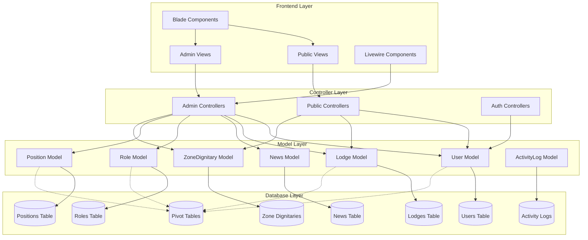
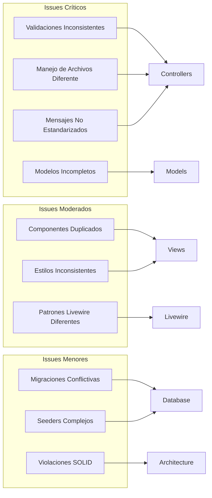
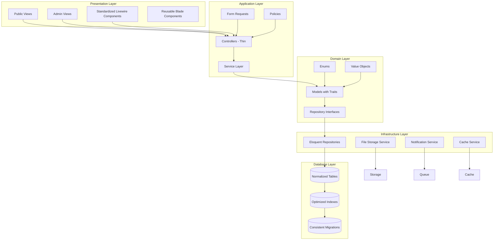
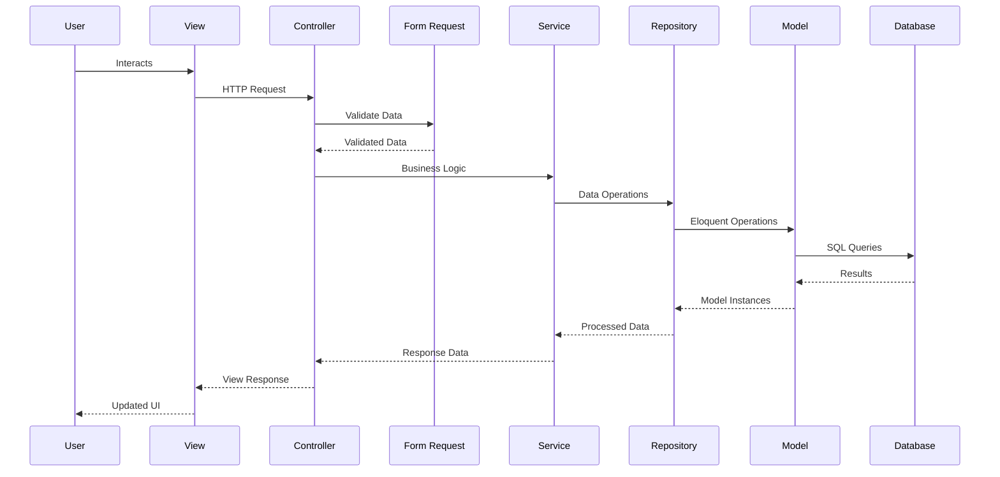

# Diagrama de Arquitectura Actual - Zona 5

## Arquitectura MVC Actual



## Problemas Identificados en la Arquitectura



## Arquitectura Propuesta (Mejorada)



## Flujo de Datos Mejorado



## Patrones de Diseño Recomendados

```mermaid
graph TD
    subgraph "Creational Patterns"
        CP1[Factory Pattern - Model Creation]
        CP2[Builder Pattern - Query Building]
    end
    
    subgraph "Structural Patterns"
        SP1[Repository Pattern - Data Access]
        SP2[Adapter Pattern - External APIs]
        SP3[Decorator Pattern - Model Enhancement]
    end
    
    subgraph "Behavioral Patterns"
        BP1[Observer Pattern - Model Events]
        BP2[Strategy Pattern - File Upload]
        BP3[Command Pattern - Background Jobs]
    end
    
    CP1 --> Models
    CP2 --> Queries
    SP1 --> DataAccess
    SP2 --> APIs
    SP3 --> Models
    BP1 --> Events
    BP2 --> FileHandling
    BP3 --> Jobs